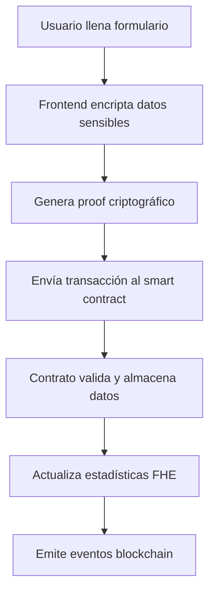

# LouDAO - Plataforma de Reportes Confidenciales con Tecnología FHEVM

## 📋 Descripción del Proyecto

**LouDAO** es una plataforma descentralizada para el reporte confidencial de casos de violencia, implementada con tecnología blockchain y **Fully Homomorphic Encryption (FHE)** de **Zama**. La plataforma permite a las víctimas reportar incidentes de manera completamente anónima y segura, manteniendo la privacidad de los datos sensibles mientras permite análisis estadísticos sobre los datos encriptados.

## 🔐 Integración con Tecnología Zama FHEVM

### ¿Qué es FHEVM?

**FHEVM (Fully Homomorphic Encryption Virtual Machine)** es la tecnología desarrollada por Zama que permite realizar computaciones directamente sobre datos encriptados sin necesidad de descifrarlos. Esto significa que:

- ✅ Los datos sensibles nunca se revelan en la blockchain
- ✅ Se pueden realizar cálculos estadísticos sobre datos encriptados
- ✅ La privacidad se mantiene a nivel criptográfico, no solo a nivel de aplicación
- ✅ Los smart contracts pueden procesar información confidencial de forma segura

### Arquitectura de Implementación

El proyecto utiliza una **arquitectura híbrida** que combina:

#### 1. **Datos Públicos** (No encriptados)
```solidity
struct PublicReport {
    string aggressor;      // Nombre del agresor
    string institution;   // Institución involucrada
    string description;   // Descripción del caso
    uint256 year;         // Año del incidente
    uint256 timestamp;    // Momento del reporte
    uint256 reportId;     // ID único del reporte
}
```

#### 2. **Datos Privados** (Encriptados con FHE)
- **Edad de la víctima** (`euint32`)
- **Tipo de relación** (`euint8`)
- **Tipo de violencia** (`euint8`)
- **Nivel de urgencia** (`euint8`)

### Smart Contract Principal: `LouDaoHybrid`

```solidity
// Importación de la biblioteca FHEVM
import "./TFHE.sol";

contract LouDaoHybrid {
    // Variables para estadísticas encriptadas
    bytes private totalAgeBytes;    // Suma total de edades (encriptada)
    bytes private ageCountBytes;    // Contador de reportes (encriptado)
    
    // Almacenamiento de datos privados como bytes encriptados
    mapping(uint256 => bytes) private privateData;
    
    function submitReport(
        string calldata _aggressor,
        string calldata _institution,
        string calldata _description,
        uint256 _year,
        bytes calldata _victimAgeBytes,      // Edad encriptada
        bytes calldata _relationshipTypeBytes, // Relación encriptada
        bytes calldata _violenceTypeBytes,   // Tipo de violencia encriptado
        bytes calldata _urgencyLevelBytes,   // Urgencia encriptada
        bytes32 _reporterHash               // Hash del reportero
    ) external {
        // ... lógica de validación ...
        
        // Actualizar estadísticas FHE
        _updateFheStatistics(_victimAgeBytes);
    }
}
```

## 🏗️ Arquitectura del Sistema

### 1. **Frontend (React + TypeScript)**
```
client/
├── src/
│   ├── components/           # Componentes de interfaz
│   ├── pages/               # Páginas principales
│   ├── lib/
│   │   ├── blockchain.ts    # Servicio de conexión blockchain
│   │   ├── fhe.ts          # Servicio de encriptación FHE
│   │   └── utils.ts        # Utilidades generales
│   └── hooks/              # Hooks personalizados
```

### 2. **Smart Contracts (Solidity)**
```
contracts/
├── LouDaoFinal.sol         # Contrato principal (sin FHE)
├── hybrid/
│   ├── LouDaoHybrid.sol    # Contrato híbrido con FHE
│   └── TFHE.sol           # Mock de biblioteca FHE para desarrollo
└── [...otros contratos]
```

### 3. **Backend/Servidor (Express + TypeScript)**
```
server/
├── index.ts               # Servidor principal
├── routes.ts              # Rutas API
└── storage.ts             # Gestión de almacenamiento
```

## 🔄 Flujo de Funcionamiento

### 1. **Envío de Reporte**



#### Código Frontend (FHE Service):
```typescript
export class FHEService {
  async encryptPrivateData(data: {
    victimAge?: string;
    relationshipType?: string;
    violenceType?: string;
    urgencyLevel?: string;
  }): Promise<EncryptedData> {
    // En producción, usaría fhevmjs
    // await initFhevmjs();
    
    return {
      victimAge: this.fheEncrypt(parseInt(data.victimAge)),
      relationshipType: this.fheEncrypt(parseInt(data.relationshipType)),
      violenceType: this.fheEncrypt(parseInt(data.violenceType)),
      urgencyLevel: this.fheEncrypt(parseInt(data.urgencyLevel))
    };
  }
}
```

### 2. **Procesamiento de Estadísticas FHE**

El smart contract puede realizar operaciones matemáticas sobre los datos encriptados:

```solidity
function _updateFheStatistics(bytes memory victimAgeBytes) private {
    // Decodificar valores encriptados
    TFHE.euint32 memory victimAge = TFHE.asEuint32FromBytes(victimAgeBytes);
    TFHE.euint32 memory currentTotal = TFHE.asEuint32FromBytes(totalAgeBytes);
    TFHE.euint32 memory currentCount = TFHE.asEuint32FromBytes(ageCountBytes);

    // Realizar operaciones FHE (sobre datos encriptados)
    TFHE.euint32 memory newTotal = TFHE.add(currentTotal, victimAge);
    TFHE.euint32 memory newCount = TFHE.add(currentCount, TFHE.asEuint32(1));

    // Almacenar resultados encriptados
    totalAgeBytes = TFHE.toBytes(newTotal);
    ageCountBytes = TFHE.toBytes(newCount);
}
```

### 3. **Detección de Patrones**

El sistema puede detectar patrones sin revelar información individual:

```solidity
// Contar reportes por agresor (público)
mapping(string => uint256[]) public reportsByAggressor;

// Estadísticas agregadas (privadas/encriptadas)
function getPrivateStatistics() external view returns (bytes memory, bytes memory) {
    return (totalAgeBytes, ageCountBytes);
}
```

## 🚀 Instalación y Configuración

### Prerrequisitos

- Node.js v18+
- MetaMask instalado
- Cuenta en Sepolia Testnet con ETH de prueba

### 1. Clonar el repositorio

```bash
git clone <repository-url>
cd SmartContractDeployer
```

### 2. Instalar dependencias

```bash
npm install
```

### 3. Configurar variables de entorno

```bash
cp .env.example .env
# Editar .env con tus configuraciones
```

### 4. Compilar contratos

```bash
npx hardhat compile
```

### 5. Ejecutar en desarrollo

```bash
# Iniciar servidor de desarrollo
npm run dev
```

## 📱 Uso de la Aplicación

### 1. **Conectar Wallet**
- Abrir la aplicación en el navegador
- Hacer clic en "Conectar Wallet"
- Autorizar conexión con MetaMask
- Cambiar a red Sepolia si es necesario

### 2. **Enviar Reporte**
```typescript
// Ejemplo de uso del servicio blockchain
const blockchainService = new BlockchainService();

await blockchainService.submitReport(
  "Nombre Agresor",           // Público
  "Institución",              // Público  
  "Descripción del caso",     // Público
  2024,                      // Público
  {
    victimAge: encryptedAge,        // Encriptado con FHE
    relationshipType: encryptedRel,  // Encriptado con FHE
    violenceType: encryptedViol,    // Encriptado con FHE
    urgencyLevel: encryptedUrg      // Encriptado con FHE
  }
);
```

### 3. **Ver Estadísticas**
- Dashboard con métricas agregadas
- Gráficos de tendencias (sin revelar datos individuales)
- Detección de patrones por agresor

## 🔧 Configuración de Red

### Sepolia Testnet (Producción)

```javascript
const SEPOLIA_CONFIG = {
  chainId: '0xAA36A7',
  chainName: 'Sepolia Testnet',
  nativeCurrency: {
    name: 'Sepolia ETH',
    symbol: 'ETH',
    decimals: 18
  },
  rpcUrls: ['https://rpc.sepolia.org'],
  blockExplorerUrls: ['https://sepolia.etherscan.io']
};
```

### Desarrollo Local

```bash
# Iniciar nodo Hardhat local
npx hardhat node

# Desplegar contratos localmente
npx hardhat deploy --network localhost
```

## 🧪 Testing

### Ejecutar Tests

```bash
# Tests en red mock (rápidos)
npx hardhat test

# Tests en red local (con estado persistente)
npx hardhat test --network localhost

# Tests en Sepolia (con encriptación real)
npx hardhat test --network sepolia
```

### Verificar Compatibilidad FHEVM

```bash
# Verificar contrato desplegado
npx hardhat fhevm check-fhevm-compatibility --network sepolia --address <CONTRACT_ADDRESS>
```

## 📊 Tecnologías Utilizadas

### Frontend
- **React 18** - Framework de interfaz
- **TypeScript** - Tipado estático
- **Tailwind CSS** - Estilos
- **Ethers.js v6** - Interacción blockchain
- **React Query** - Estado de servidor

### Blockchain
- **Solidity ^0.8.24** - Smart contracts
- **Hardhat** - Framework de desarrollo
- **FHEVM (@fhevm/solidity)** - Encriptación homomórfica
- **Sepolia Testnet** - Red de pruebas

### Backend
- **Express.js** - Servidor API
- **TypeScript** - Tipado estático
- **Drizzle ORM** - Base de datos

## 🔒 Seguridad y Privacidad

### Características de Seguridad

1. **Encriptación a Nivel Criptográfico**: Los datos sensibles se encriptan usando FHE antes de enviarse a la blockchain
2. **Zero-Knowledge**: El contrato puede procesar datos sin conocer su contenido real
3. **Inmutabilidad**: Los reportes quedan grabados permanentemente en blockchain
4. **Descentralización**: No hay un punto único de falla
5. **Anonimato**: Los reporteros pueden mantener su identidad privada

### Consideraciones de Privacidad

- **Datos Públicos**: Nombre del agresor, institución, descripción general
- **Datos Privados**: Edad de víctima, relación, tipo de violencia, urgencia
- **Análisis Estadístico**: Posible sobre datos agregados sin revelar casos individuales

## 📈 Roadmap

### Versión Actual (v1.0)
- ✅ Smart contracts básicos
- ✅ Interfaz web funcional
- ✅ Integración FHE mock
- ✅ Deploy en Sepolia

### Próximas Versiones
- 🔄 **v1.1**: Integración completa con fhevmjs
- 📋 **v1.2**: Dashboard avanzado de analytics
- 🔐 **v1.3**: Sistema de permisos granular
- 📊 **v2.0**: Machine Learning sobre datos FHE

## 🤝 Contribuir

1. Fork del proyecto
2. Crear branch para feature (`git checkout -b feature/nueva-funcionalidad`)
3. Commit de cambios (`git commit -am 'Agregar nueva funcionalidad'`)
4. Push al branch (`git push origin feature/nueva-funcionalidad`)
5. Crear Pull Request

## 📄 Licencia

Este proyecto está licenciado bajo la Licencia MIT - ver el archivo [LICENSE](LICENSE) para detalles.

## 📞 Contacto

Para preguntas sobre el proyecto o colaboraciones, contactar al equipo de desarrollo.

---

**Nota**: Este proyecto utiliza tecnología experimental de Zama FHEVM. Para uso en producción, se recomienda una auditoría completa de seguridad y testing exhaustivo en redes de prueba.